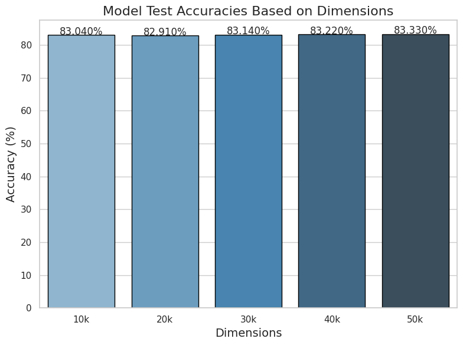
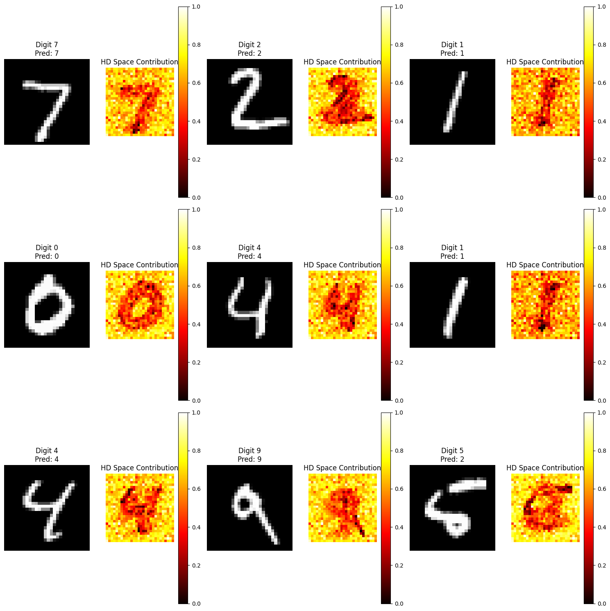

# Hyper-dimensional-computing
> How does the brain work? 

It doesn’t process information word by word or token by token. Instead, it operates on higher-level abstractions—concepts, ideas, patterns. That’s what inspired me when I read about the Large Concept Model (LCM) and how it reasons using abstract concept embeddings.

The paper by Meta [LCM](https://arxiv.org/pdf/2412.08821) moves beyond token-level processing and works in a concept space, which feels a lot like how our brain organizes thoughts. Similarly, Hyper-Dimensional Computing (HDC) uses high-dimensional vectors to encode and process information, mirroring how the brain handles large amounts of data efficiently and robustly.

This project is an experiment to explore and understand Hyper-Dimensional Computing (HDC). It's a hands-on way for me to learn by experimenting and trying things out—nothing too fancy or ambitious, just diving in and seeing how it works.

>[!IMPORTANT]
> Everything in this repo is a mix of learning and experimentation by me—nothing is final or polished!


> Hyperdimensional Computing (HDC) is a computation model
that relies on very high dimensionality and randomness. Inspired by neuroscience, it seeks to mimic and exploit important characteristics of the animal brain while balancing
accuracy, efficiency and robustness. The central idea
is to represent inputs 𝑥 ∈ X by projecting them onto a hyperspace H = {0, 1}
𝑑,with 𝑑 ≈ 10,000 dimensions. This mapping 𝜙 : X → H is called encoding, and the resulting
representations 𝜙 (𝑥) are named hypervectors.

# Experiments and Testings 
We evaluated the performance of our classification model, and the results are displayed below. Additionally, we used heatmaps to gain insights into the areas of the input data the model focused on during learning.

<p align="center">
  
</p>

<p align="center">
  
</p>

# Acknowledgement 

```bash
@misc{nunes2025,
  author = {Igor Nunes and Mike Heddes and Tony Givargis and Alexandru Nicolau},
  title = {An Extension to Basis-Hypervectors for Learning from Circular Data in Hyperdimensional Computing},
  year = {2025},
  note = {Accessed: 2025-01-13},
  institution = {Department of Computer Science, University of California, Irvine},
  url = {https://arxiv.org/pdf/2205.07920}    
}
```

```bash
@misc{stock2022,
  author = {Michiel Stock},
  title = {Hyperdimensional Computing Tutorial},
  year = {2022},
  url = {https://michielstock.github.io/posts/2022/2022-10-04-HDVtutorial/},
  note = {Accessed: 2025-01-11}
}
```
```bash
@misc{aragon_youtube,
  author = {Richard Aragon},
  title = {Hyperdimensional Computing on YouTube},
  publisher = {YouTube},
  url = {https://www.youtube.com/@richardaragon8471/community},
  note = {Accessed: 2025-01-11}
}
```
```bash
@misc{aragon_video2022,
  author = {Richard Aragon},
  title = {Understanding Hyperdimensional Computing},
  publisher = {YouTube},
  year = {2022},
  url = {https://www.youtube.com/watch?v=zUCoxhExe0o&t=940s},
  note = {Accessed: 2025-01-11}
}
```