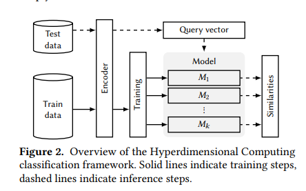

# Introduction to HDC / VSA 

> Hyperdimensional Computing (HDC) is a computation model
that relies on very high dimensionality and randomness. Inspired by neuroscience, it seeks to mimic and exploit important characteristics of the animal brain while balancing
accuracy, efficiency and robustness. The central idea
is to represent inputs 𝑥 ∈ X by projecting them onto a hyperspace H = {0, 1}
𝑑,with 𝑑 ≈ 10,000 dimensions. This mapping 𝜙 : X → H is called encoding, and the resulting
representations 𝜙 (𝑥) are named hypervectors.

### Operations in HDC 

1. Binding: "Associating Information"
The binding operation combines two hypervectors to create a third hypervector that is dissimilar to both of them. This operation is often implemented using element-wise XOR for binary hypervectors.

2. Bundling: "Representing a Set of Information"
Bundling combines multiple hypervectors into a single hypervector that is similar to all of them, effectively representing their "average." This operation is implemented as an element-wise majority vote.

3. Permuting: "Establishing Order"
The permutation operation modifies a hypervector to differentiate sequences or establish order. It applies a cyclic shift or a permutation matrix, making the output dissimilar to the input. This operation is invertible, meaning you can retrieve the original vector if needed.

For simplicity I want to focus only on classfication and not regression but if you want to learn more please read this paper [An Extension to Basis-Hypervectors for Learning
from Circular Data in Hyperdimensional Computing](https://arxiv.org/pdf/2205.07920)

<p align="center">
  
</p>

# HDC Classification Framework

The Hyperdimensional Computing (HDC) classification process follows these key steps:

## Training Phase
Once the encoding function φ is defined, for each class i ∈ {1,...,k} in the training set, we construct a hypervector Mi as:

```
Mi = Σ[j:l(xj)=i] φ(xj)
```

Where:
- xj ∈ X is a training sample
- l(xj) ∈ {1,...,k} is its respective label
- Σ represents the bundling operation

The hypervector Mi serves as a "prototype" for its class, having the smallest average distance to all encoded training samples of class i. The complete trained model is denoted as:

```
M = {M1,...,Mk}
```

## Classification Phase
To classify a new sample x̂ using the trained model M, we:
1. Encode the query sample using φ(x̂)
2. Compare it with each class-vector
3. Select the class with the most similar vector:

```
l*(x̂) = argmin[i ∈ {1,...,k}] δ(φ(x̂), Mi)
```

Where:
- l*(x̂) ∈ {1,...,k} is the predicted class
- δ is the similarity metric